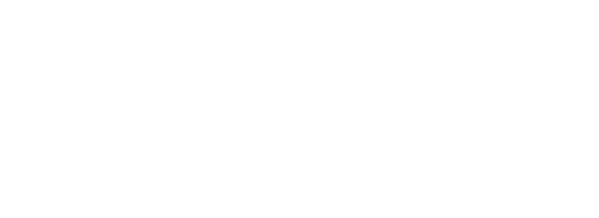
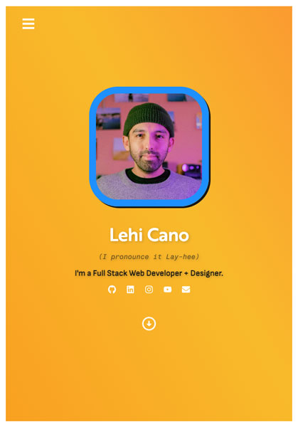
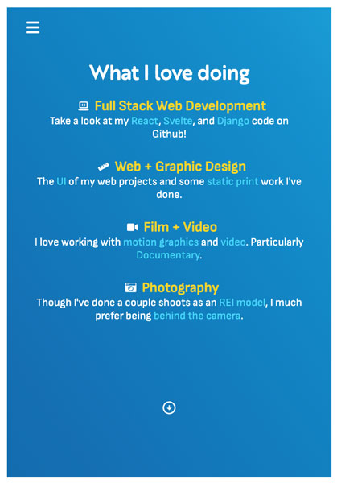
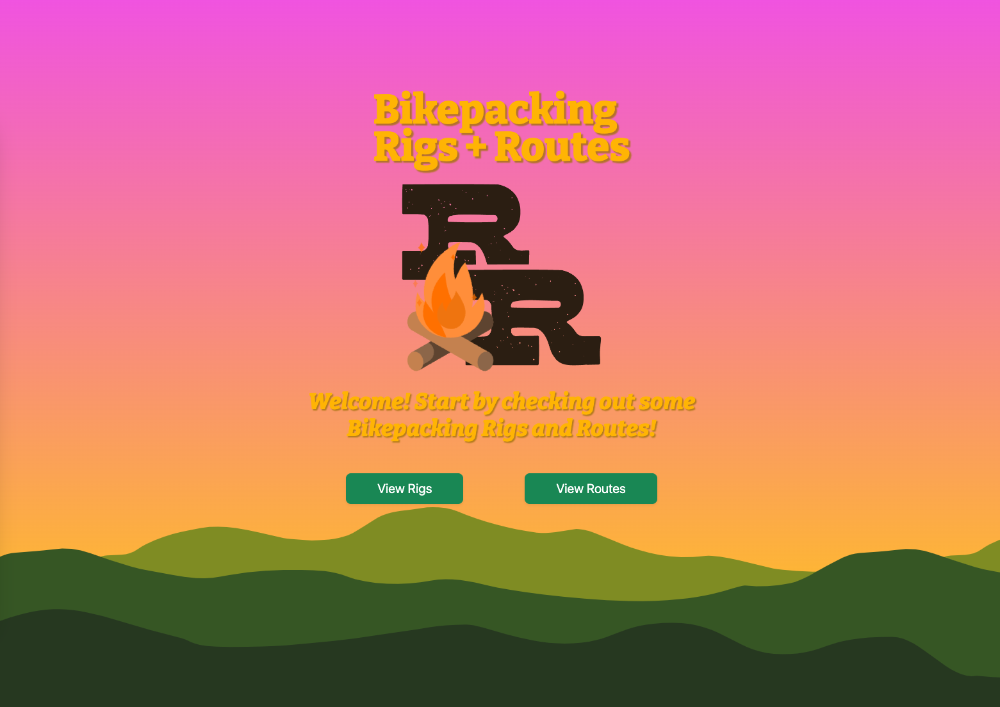
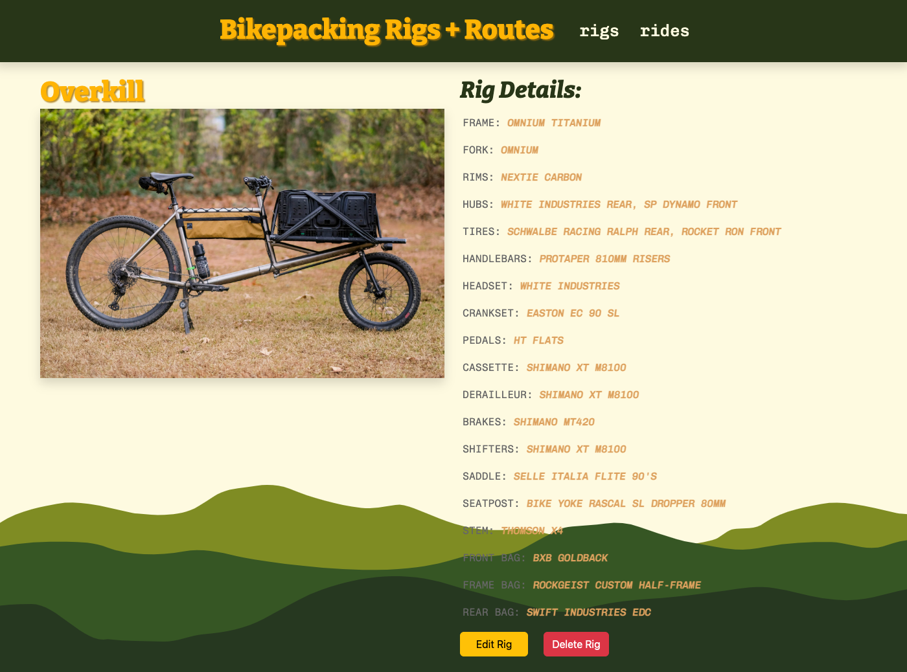
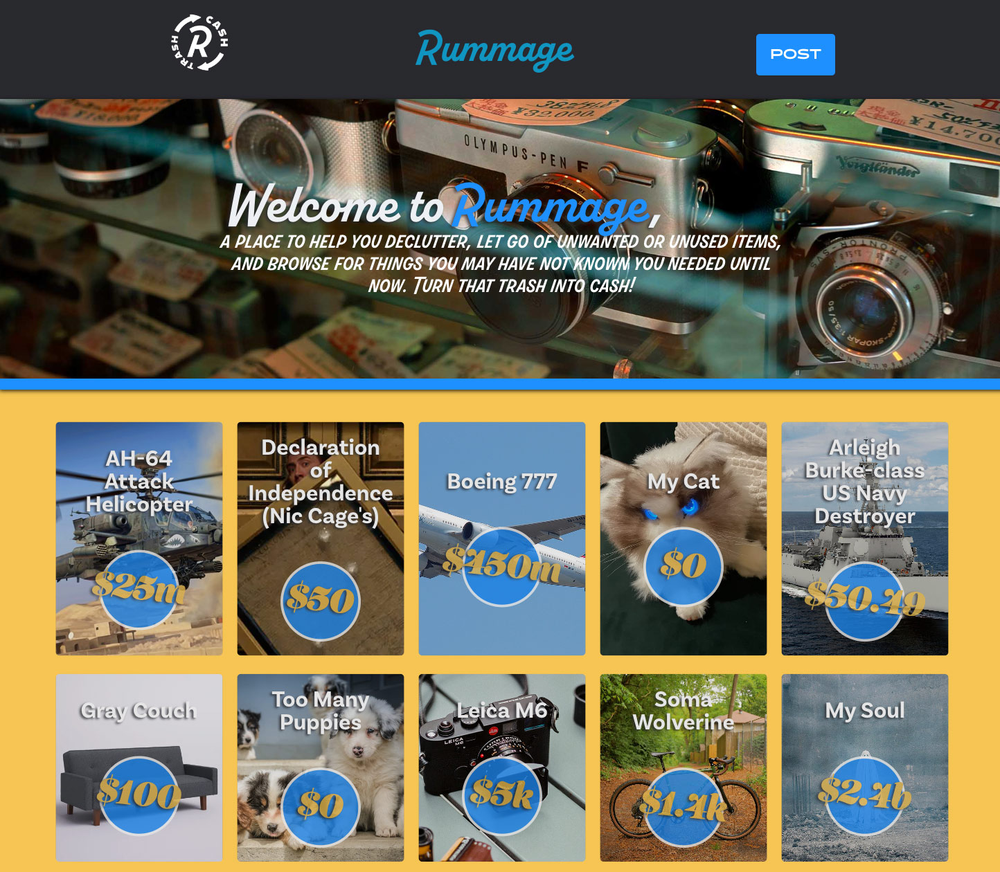
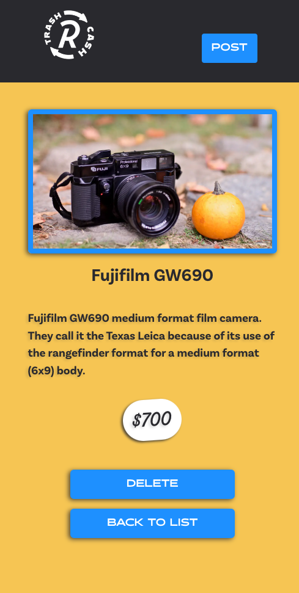
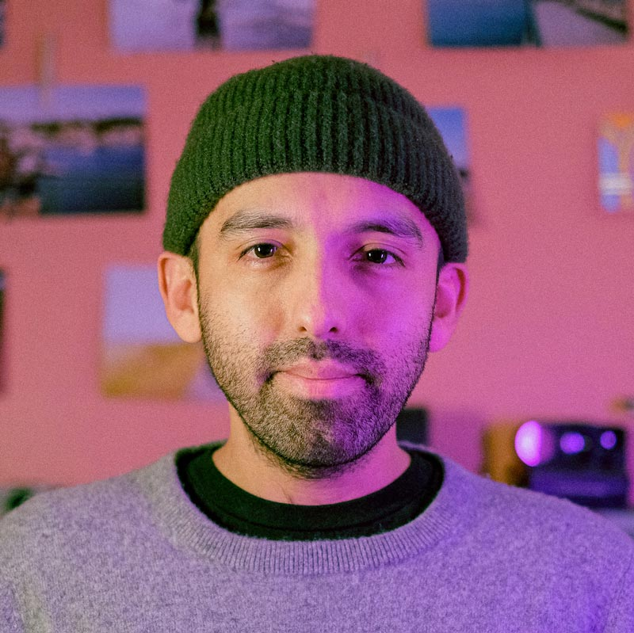

---

<table>
<tr>
<td>
  I employ my foundation in visual art and communication design using modern front end frameworks and utilities to build interactive web apps. I strive to take creative approaches to practical applications. I love picking at a problem or working towards a solution to break down large complex tasks into manageable bits to find an answer.
</td>
</tr>
</table>

## I've worked with:

### Code:

| Code       |          |
| ---------- | -------- |
| React      | Node     |
| JavaScript | Express  |
| jQuery     | MongoDB  |
| HTML5      | CSS3     |
| Django     | Heroku   |
| Bootstrap  | Tailwind |
| Git        | Bash     |

### Software

| Software             |     |
| -------------------- | --- |
| VS Code              |     |
| Figma                |     |
| Adobe Creative Cloud |     |

# Projects

## My Portfolio Site

### React, Custom Web Fonts, Custom CSS

I built my portolio site with React, Font Awesome Icons, Adobe Typekit fonts, and custom CSS. Built to be fully responsive and interactive.

### Check it out here : [Lehi.me](https://lehi.me/)

|  |  |

## Rigs & Routes

### Mongoose/Express/Node Full CRUD Site

A site for sharing bikepacking rigs/bikes and routes/trips. Users will be able to login or register, upload details on the build of their bike (things such as frame manufacturer, wheel size, drivetrain, bags used), and an option to add a trip they've taken on the bike.

### Check it out here : [Rigs & Routes](https://rigs-n-routes.herokuapp.com/)

|  | |

## Rummage - Trash to Cash

### Mongoose/Express/React/Node Team project.

A community marketplace for getting rid of unused, but valuable items that are better off being used by someone, not cluttering your home. In a team of three, I was Product Manager and Lead Front End Developer. [Moe Ahmed](https://github.com/Kingsimba754) was the Deployment Manager, and [Jimmy Huang](https://github.com/maydayjimmy) took the Lead Back End role.

### Check it out here : [Rummage - Trash to Cash](https://rummage-rumg.netlify.app/)

|  |  |

## Socials/Contact

Portfolio [lehi.me](https://lehi.me) | Email [onacihel@gmail.com](mailto:onacihel@gmail.com)\
[Linked In](https://www.linkedin.com/in/lehicano/) | [Instagram](https://www.instagram.com/stay.loose/) | [Youtubes](https://youtube.com/user/onacihel)
